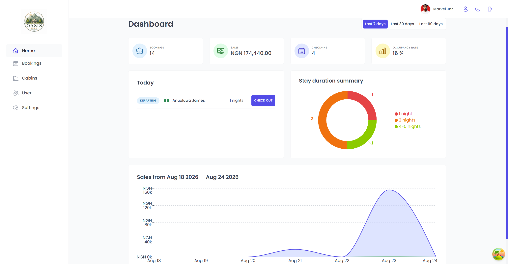
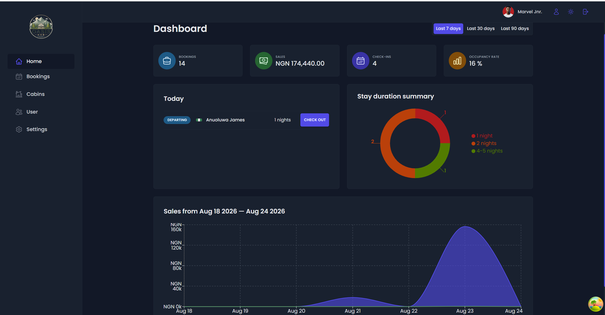
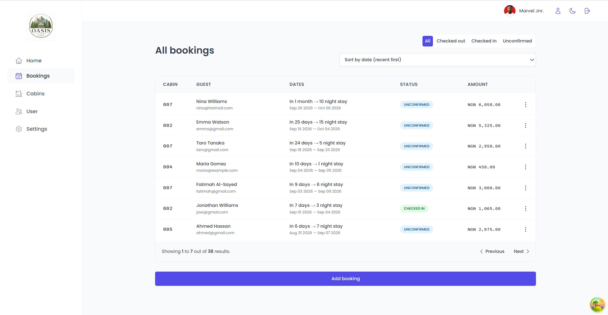
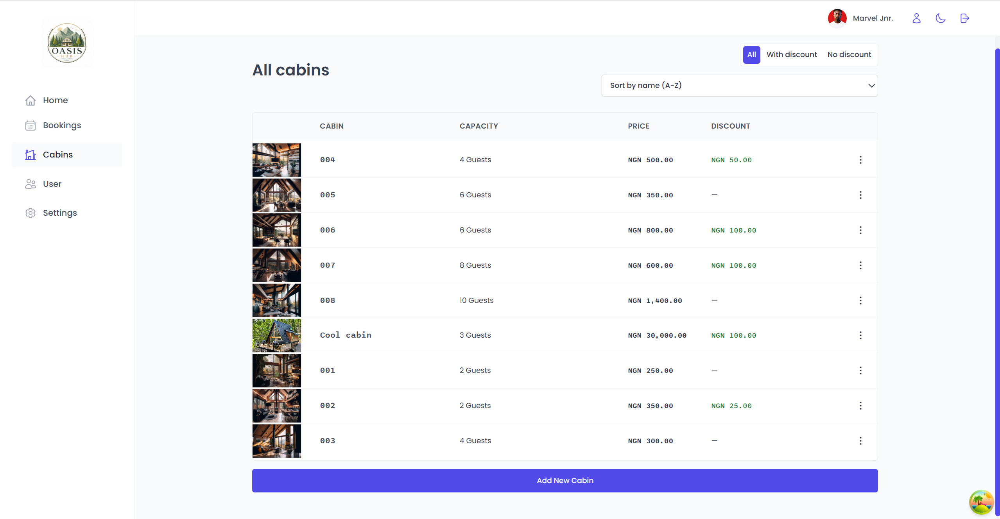
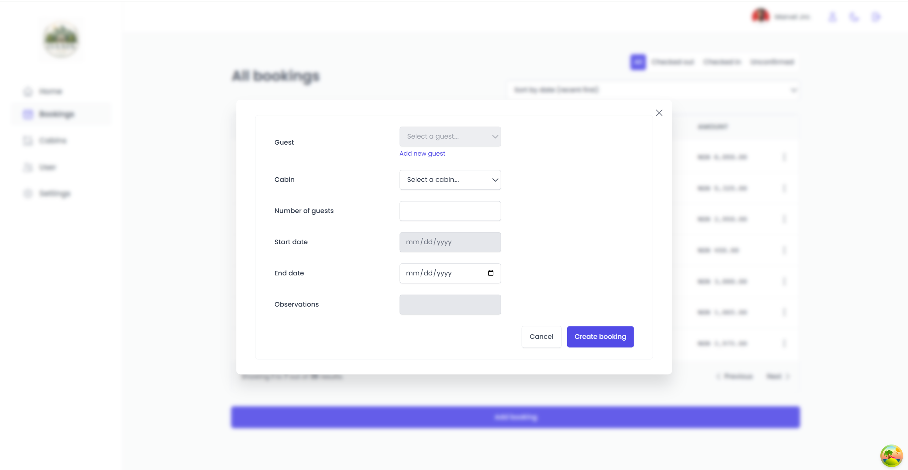
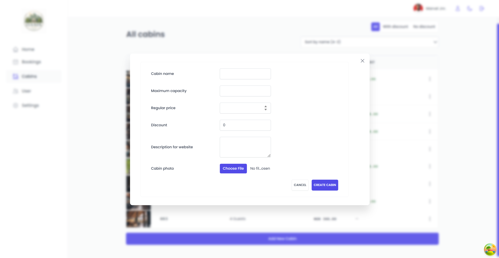
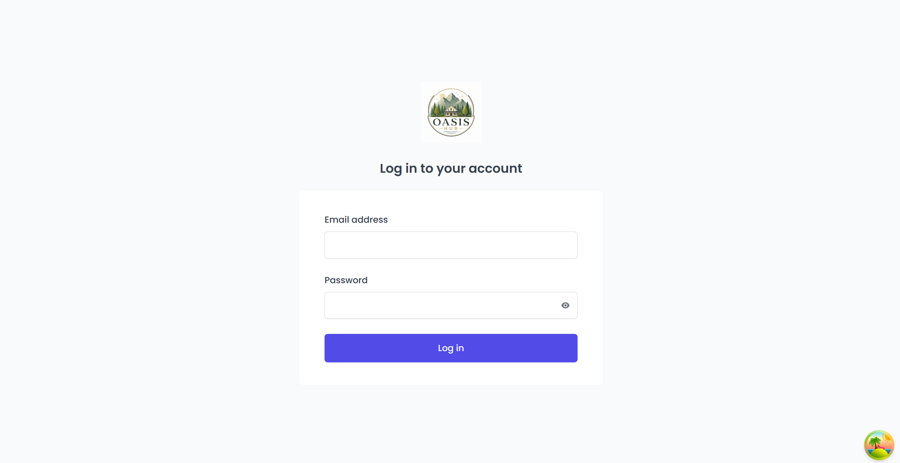

# Oasis Hub 🏨

A modern hotel management dashboard for managing cabins, bookings, guests, stays, and day-to-day hotel operations.

Oasis Hub is a React-based hotel management application built as a hands-on learning project and customized beyond its original tutorial foundation. It focuses on practical frontend development patterns, reusable UI components, data fetching, authentication, form handling, responsive design, and Supabase integration.

> **Educational foundation:** This project was inspired by and developed from the *The Wild Oasis* project in Jonas Schmedtmann's Ultimate React Course. The application has been rebranded as **Oasis Hub** and customized/refined as part of my own learning and development journey.

---

## ✨ Features

### Dashboard
- Overview of hotel performance and activity
- Booking and revenue statistics
- Recent bookings and today's activities
- Responsive charts and data visualizations
- Dark and light mode support

### Booking Management
- View and paginate bookings
- Filter and sort bookings
- View detailed booking information
- Create new bookings
- Check guests in and out
- Update booking status and payment information

### Cabin Management
- View available cabins
- Create new cabins
- Edit existing cabins
- Delete cabins
- Upload cabin images through Supabase Storage
- Manage cabin capacity and pricing information

### Guest Management
- Create and manage guest records
- Store guest information such as name, email, nationality, and national flag
- Associate guests with bookings

### Authentication & Account
- Secure login through Supabase Authentication
- Protected application routes
- User account management
- Update profile information, password, and avatar

### Application Settings
- Configure hotel-wide settings
- Manage application preferences
- Persistent dark/light mode

### User Experience
- Responsive layout across screen sizes
- Reusable component architecture
- Form validation and feedback
- Loading and error states
- Toast notifications
- Confirmation dialogs for destructive actions
- Client-side pagination, filtering, and sorting

---

## 📸 Screenshots

### Dashboard



### Dark Mode



### Bookings



### Cabins



### Create Booking



### Create Cabin



### Login



---

## 🛠️ Tech Stack

### Frontend
- **React 19**
- **Vite**
- **React Router**
- **Styled Components**
- **React Icons**

### Data & State Management
- **TanStack React Query**
- **Supabase**
- React Context API

### Forms & UX
- **React Hook Form**
- **React Hot Toast**
- **React Error Boundary**
- **date-fns**

### Data Visualization
- **Recharts**

### Development
- **ESLint**
- **Vite**

---

## 🧠 What This Project Demonstrates

Oasis Hub was built to apply modern React development concepts in a realistic application rather than simply completing isolated tutorials.

Key concepts demonstrated include:

- Component-based architecture
- Reusable UI components
- Custom React hooks
- Context API
- Server-state management with TanStack React Query
- Mutations and cache invalidation
- React Router protected routes
- Form management with React Hook Form
- Supabase authentication
- Supabase database queries
- Supabase Storage
- CRUD operations
- Pagination, filtering, and sorting
- Responsive UI development
- Dark mode implementation
- Error and loading-state handling
- Reusable modal and form patterns

---

## 📁 Project Structure

```text
oasis-hub/
├── public/
├── src/
│   ├── context/          # React context providers
│   ├── data/             # Seed/demo data
│   ├── features/         # Feature-specific components and logic
│   ├── hooks/            # Custom React hooks
│   ├── pages/            # Application pages
│   ├── services/         # Supabase/API communication
│   ├── styles/           # Global styling
│   ├── ui/               # Reusable UI components
│   ├── utils/            # Helper functions and constants
│   ├── App.jsx
│   └── main.jsx
├── oasis-hub_screenshots/
├── .env
├── .gitignore
├── package.json
└── README.md
```

---

## 🚀 Getting Started

### Prerequisites

Make sure you have the following installed:

- [Node.js](https://nodejs.org/)
- npm
- A Supabase project

### 1. Clone the repository

```bash
git clone https://github.com/adenijimarvellous/Oasis-hub.git
cd Oasis-hub
```

### 2. Install dependencies

```bash
npm install
```

### 3. Configure environment variables

Create a `.env` file in the project root:

```env
VITE_SUPABASE_URL=your_supabase_project_url
VITE_SUPABASE_KEY=your_supabase_anon_or_publishable_key
```

> Never commit private credentials, service-role keys, passwords, or other secrets to version control.

### 4. Start the development server

```bash
npm run dev
```

The application will be available through the local URL shown by Vite.

---

## 📜 Available Scripts

| Command | Description |
|---|---|
| `npm run dev` | Starts the Vite development server |
| `npm run build` | Creates a production build |
| `npm run preview` | Previews the production build locally |
| `npm run lint` | Runs ESLint |

---

## 🗄️ Supabase

Oasis Hub uses Supabase for:

- Authentication
- PostgreSQL database operations
- Cabin image storage
- User avatar storage
- Bookings
- Guests
- Cabins
- Application settings

To run the project with your own Supabase instance, configure the required environment variables and recreate the required database tables and Storage buckets.

---

## 🎓 Acknowledgements

Special thanks to **Jonas Schmedtmann**, whose *Ultimate React Course* and *The Wild Oasis* project provided the educational foundation for this application.

His teaching approach, emphasis on understanding React fundamentals, and focus on building realistic applications played an important role in my development journey.

**Oasis Hub started from that learning foundation and was subsequently rebranded, customized, refined, and extended as part of my own practice and continued growth as a developer.**

Thank you, Jonas, for the knowledge and inspiration. 🙏🏽

---

## 👨🏽‍💻 Author

**Adeniji Marvellous**

Frontend Developer & Mass Communication graduate

- GitHub: [@adenijimarvellous](https://github.com/adenijimarvellous)

---

## 📌 Project Status

Oasis Hub is an actively developed learning and portfolio project.

Future improvements may include:

- Further accessibility improvements
- Additional analytics
- More advanced hotel operations
- Additional automated testing
- Performance optimizations
- Further UI/UX refinements

---

## 📄 License

This project is intended primarily for educational and portfolio purposes.

The original educational concepts and project foundation are attributed to Jonas Schmedtmann and the *The Wild Oasis* project from the Ultimate React Course.
